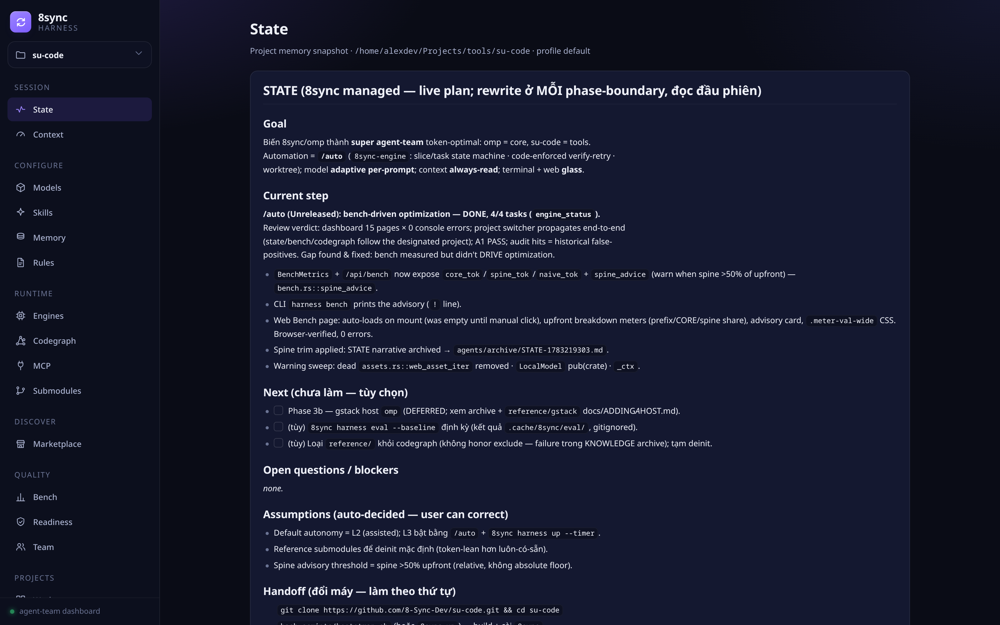
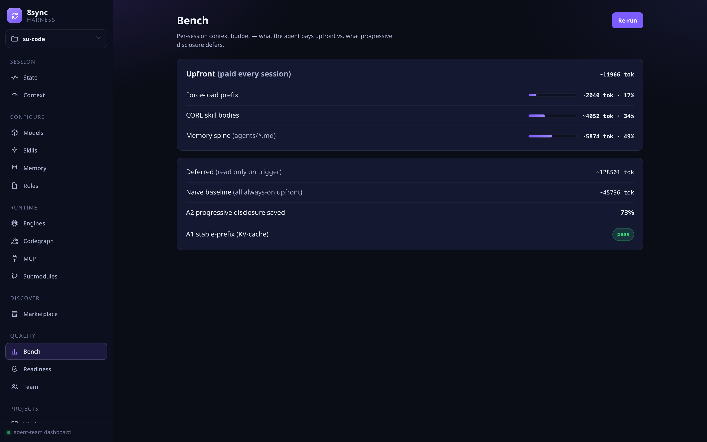
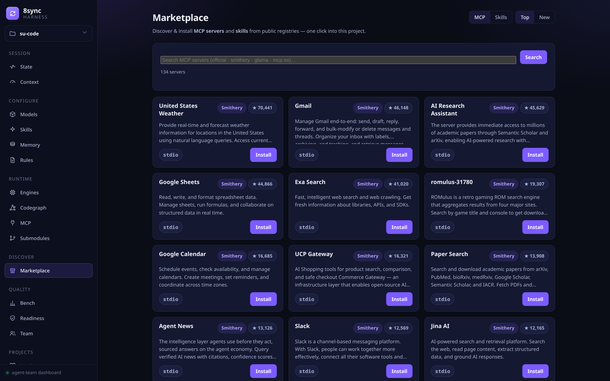

# su-code (`8sync`)

> Terminal-first AI coding harness for CachyOS/Arch + Kitty + Helix + [omp](https://omp.sh).
> Keep your normal CLI workflow; AI agents observe project context, load `agents/*` memory, and execute tasks on demand.



---

## Links

- **Website / docs**: <https://8-sync-dev.github.io/su-code> (auto-deployed from `docs/` via [`.github/workflows/pages.yml`](.github/workflows/pages.yml))
- **Repo**: <https://github.com/8-Sync-Dev/su-code>
- **Discussions**: <https://github.com/orgs/8-Sync-Dev/discussions>
- **AI engine**: [omp](https://omp.sh) (oh-my-pi) — `8sync` wraps `omp --continue` to keep one session per project.

> Note: `8sync` is a **coding harness**; it does not install a desktop environment. Install Hyprland/Caelestia/HyDE separately, following their upstreams.

---

## TL;DR

```bash
# 1. Install — one-liner, prebuilt binary (NO git/rust/cargo required)
curl -fsSL https://raw.githubusercontent.com/8-Sync-Dev/su-code/main/install.sh | sh
8sync setup                       # install the AI core (omp + codegraph + MCP/skills + gh) — y/N per profile
8sync doctor                      # verify (auto-cleans stale state if any)

# 2. Enter a project → stand up the harness (1 command, idempotent)
cd <project>
8sync harness                     # skills + codegraph index + AGENTS.md + memory — safe to re-run anytime
8sync .                           # open a session (kitty 3-pane + omp)

# 3. Dashboard — monitor + CRUD the whole agent-team from the browser
8sync harness web                 # http://127.0.0.1:8731 — models, skills, memory, rules,
                                  # engines, Codegraph graph, bench, team… edit live, writes immediately

# Daily
8sync ai "explain this codebase"  # one-shot prompt; leave empty to resume the session
8sync ship "feat: ..."            # add + commit + push + gh pr create
```

---

## Installation

### 1. One-liner (recommended) — download the prebuilt binary

No git, rustup, or cargo needed. `install.sh` resolves the latest release, downloads `8sync-<tag>-linux-x86_64` from GitHub Releases, and places it at `~/.local/bin/8sync` (atomically replacing any previous version).

```bash
curl -fsSL https://raw.githubusercontent.com/8-Sync-Dev/su-code/main/install.sh | sh
```

- **Upgrade**: run the exact same command again, or `8sync up`.
- **Pin a version**: `curl -fsSL .../install.sh | SUSYNC_VERSION=v0.12.1 sh`
- **Change the install dir**: `... | SUSYNC_BIN_DIR=~/bin sh`
- **Uninstall**: `curl -fsSL .../install.sh | sh -s -- --uninstall`

PATH entries for `~/.local/bin`, `~/.cargo/bin`, `~/.bun/bin`, `~/.encore/bin` are auto-patched into zsh / bash / fish the first time you run `8sync setup` (see Stage A). If `~/.local/bin` is not on PATH at install time, the script prints a hint.

### 2. Build from source (contributors) — `scripts/bootstrap.sh`

Use this when you want to build from code (no prebuilt for your arch yet, or for development). It installs rustup (if missing) → `cargo build --release --locked` → copies the binary to `~/.local/bin/8sync`.

```bash
git clone https://github.com/8-Sync-Dev/su-code.git
cd su-code
bash scripts/bootstrap.sh
```

### 3. `8sync setup` — install the rest

Stage A (harness, always idempotent):

- `pacman -S --needed helix lazygit abduco github-cli`
- omp CLI via `curl -fsSL https://omp.sh/install | sh` (skipped if already present)
- writes configs: `~/.config/helix/`, `~/.config/kitty/8sync.session`, `~/.config/8sync/{global,skills}.toml`
- writes skills (35 bundled) to `~/.omp/skills/<name>/SKILL.md` + `00-force-load.md`. Always-on: codegraph, karpathy-guidelines, ponytail, assp-skill, impeccable, taste-skill, 8sync-cli, image-routing. On-demand: code-review-and-quality, senior-security, senior-frontend, full-flow, last30days + 18 research skills (`social-growth` opt-in)

Stage B (community profiles, opt-in y/N per profile):

| Profile | Description |
|---|---|
| `dev-stack` | Docker + Node/npm/bun/pnpm + Encore + TS LSP + build chain |
| `nvidia` | Auto-detects GPU family → open-dkms / dkms (skipped if CachyOS chwd already installed it) |
| `warp` | Cloudflare WARP VPN + DoH + MASQUE (toggle via `8sync sec`) |
| `bluetooth` | bluez + bluez-utils + service enable (control via `8sync bt`) |

Common flags:

| Flag | Effect |
|---|---|
| `8sync setup --dry-run` | Print the plan, change nothing |
| `8sync setup --no-profile` | Stage A only |
| `8sync setup --community` | Stage A + dev-stack + bluetooth (does NOT include warp) |
| `8sync setup --profile <name>` | Stage A + apply one specific profile |
| `8sync setup profile list \| show <n> \| apply <n>` | Manage profiles after setup |

### 4. Update

```bash
8sync up                         # self-update the binary (GitHub release) + omp update
```

Or rebuild manually from source:

```bash
cd su-code && git pull
cargo build --release
install -m755 target/release/8sync ~/.local/bin/8sync
```

System packages (`pacman -Syu`) are **not** run automatically — you decide when to update CachyOS rolling.

---

## Main verbs

### Vibe loop (daily)

| Command | Description |
|---|---|
| `8sync .` | Open/attach the current project's session. Kitty with `allow_remote_control yes` → 3-pane; otherwise → soft 1-pane + `omp --continue` inside abduco |
| `8sync ai [prompt]` | Empty/`continue` → `omp --continue`; with a prompt → `omp -p "..."` |
| `8sync find <kw>` | rg/fd + fzf preview → open the editor at `file:line` |
| `8sync note "msg" [-t tag]` | Append to `agents/NOTES.md` |
| `8sync run [dev\|build\|test\|fmt\|lint]` | Project runner via per-stack recipe |
| `8sync ship "msg"` | `git add -A && commit && push && gh pr create` |

### Session management (sub-commands of `.`)

`8sync . ls` / `to <n>` / `new <n> [cmd]` / `rm <n>` / `wipe` / `kick`

### Harness (agent-team bootstrap + dashboard)

| Command | Description |
|---|---|
| `8sync harness` | **One command (idempotent):** deploy/update bundled skills + codegraph binary + external packs (ponytail/addyosmani, best-effort) → `~/.omp/skills/`, mirror into `agents/skills/`, `codegraph init`, seed `agents/*` + `CHANGELOG.md`, inject the force-load block into `AGENTS.md`/`CLAUDE.md`. Always safe to re-run |
| `8sync harness init` | First-time full bootstrap (progress UI) + managed `.gitignore` + gitleaks pre-commit hook. `--force` re-mirrors everything, overwriting |
| `8sync harness up` | Refresh state: re-inject + refresh `KNOWLEDGE.md` + re-index codegraph. `--pull` re-pulls skills · `--commit` git-commits memory (gitleaks scan first) · `--loop 10m` (foreground) · `--timer 30m\|off` (systemd user timer, for background runs) |
| **`8sync harness web`** | **Local dashboard** (axum + Vite, `http://127.0.0.1:8731`) — view & **CRUD** the whole agent-team from the browser (see the Dashboard section) |
| `8sync harness gateway [apply\|key <K>\|verify\|status]` | Deploy/verify the omp model-gateway (`~/.omp/agent/models.yml`): 9router + `thinking.mode` fix for claude-sonnet-5. `verify` pings; HTTP 200 = healthy |
| `8sync harness add-local-model <path.gguf\|org/repo\|url> [name]` | Load a local **GGUF** through **mistral.rs** (Rust, memory-safe) → serve an OpenAI endpoint + register it as omp provider `local/<name>`. `list`/`rm <name>` to manage. Then `8sync ai --model local/<name>` |
| `8sync harness bench` | Measure the loop's context budget (upfront vs deferred tokens + KV-cache gate). Prints the upfront breakdown — prefix / CORE / memory-spine — and a spine advisory when the memory spine eats more than 50% of the upfront budget |
| `8sync harness audit` | Scan docs: stale paths / oversized / junk + churn (doc-hygiene) |
| `8sync harness eval [--baseline]` | Run the quality task-suite through omp; `--baseline` saves the reference |
| `8sync harness toolstats` | SQLite tracker: optimizer rate (codegraph/cbm/serena) vs fallback (grep/read) + failures per tool |
| `8sync harness compaction [pct]` | View/set the omp auto-compaction threshold (anti-forget; default 50%) |
| `8sync harness model [k v]` | View/edit `~/.config/8sync/models.toml` (routing for `/auto` + `8sync ai`) |

### Skill system

| Command | Description |
|---|---|
| `8sync skill` | List global (`~/.omp/skills/`) + local (`agents/skills/`) skills |
| `8sync skill add <github-url>` | Clone into **both** global + project; **collection-aware** (repo with `skills/<name>/` → installs every sub-skill, e.g. `addyosmani/agent-skills`). Rewrites the `<!-- 8sync:skills:* -->` block in `AGENTS.md` |
| `8sync skill add gh:owner/repo` · `<url>@<ref>` · `builtin:<name>` | Short form · pin a commit/tag (writes `rev` into `skills.toml` = lockfile) · enable an opt-in bundled skill (e.g. `builtin:social-growth`) |
| `8sync skill update [name]` | Re-pull from `src` (git dedup by URL, honors `rev` pins) |
| `8sync skill gen <id> <id>` | Fuse N local skills into 1 combined SKILL.md |

**35 skills bundled** in the binary. Always-on (read in order): codegraph → karpathy → ponytail → assp → impeccable → taste → 8sync-cli → image-routing. On-demand: code-review-and-quality · senior-security · senior-frontend · full-flow · last30days + 18 research skills (deep-research, literature-review, autoresearch, paper-writing…). `encore-deploy` is tech-gated; `social-growth` is opt-in. Idempotent: re-running `add` with the same URL → `git pull --ff-only`.


### Lifecycle

| Command | Description |
|---|---|
| `8sync setup` | Install harness + profiles (see Installation) |
| `8sync up` | Self-update the binary + `omp update` |
| `8sync doctor` | Health check (kitty remote, omp, helix, gh, configs, profiles, WARP/ufw) |
| `8sync flow` | Workflow help, ordered by usage step |
| `8sync help` | Cheatsheet (alias of `8sync` with no args) |

### AI tooling

| Command | Description |
|---|---|
| `8sync shot <url\|file>` | Render a web page/file → PNG (for the image-routing skill) |
| `8sync diff-img [ref]` | Git diff → PNG |
| `8sync pdf-img <file>` | PDF pages → PNG |
| `8sync locate  "<prompt>"` | Visual grounding (NVIDIA LocateAnything-3B via ggml, CPU/GPU): image + open-vocabulary prompt → labeled boxes + click-center coordinates. One-time `--setup` first; `--annotated out.png` draws the boxes. Model is research / non-commercial use only |

### Security

`8sync sec [on\|off\|toggle\|status]` — enable/disable Cloudflare WARP VPN + ufw firewall together. Subs: `sec warp …`, `sec ufw …`.

### Machine (desktop / housekeeping)

| Command | Description |
|---|---|
| `8sync bt [on\|off\|fix\|restart]` | Bluetooth (bluez): status / on-off / troubleshoot a dead adapter / restart |
| `8sync clean [--deep\|--ram\|--gpu\|--timer 1h]` | Reclaim disk (paccache/journal/thumbnails) + CPU/GPU/RAM report. `--deep` removes orphans; never touches models/package download caches |
| `8sync theme [list\|set <name>\|show]` | Switch the kitty color palette live (colors only, structure untouched) |
| `8sync bg [set\|list\|add <url>\|search <q>]` | Kitty wallpaper live swap + inline preview; `bg search` = wallhaven.cc (no API key) |

Every verb supports `-h` / `--help` with a detailed `EXAMPLES` block.

---

## Dashboard — `8sync harness web`

A local web app (axum backend + Vite/React FE, embedded in the binary) to **view and control the whole agent-team** instead of hand-editing config files:

```bash
8sync harness web                 # http://127.0.0.1:8731 (auto-opens the browser)
8sync harness web --port 9000     # change the port
8sync harness web --no-open       # no auto-open (background / headless)
```

The sidebar is grouped — every page reads **real data** (no mocks), and most pages support **CRUD written straight** to config/memory:

| Group | Page | What you can do |
|---|---|---|
| Session | **State · Context** | Live plan (`agents/STATE.md`), real session token/compaction stats |
| Configure | **Models · Skills · Memory · Rules** | Change the model per role/task (writes `models.toml` immediately) · filter + cycle tiers across the 35 skills · edit the 6 memory files (STATE/KNOWLEDGE…) · add/remove rules |
| Runtime | **Engines · Codegraph · MCP · Submodules** | Engine status (codegraph/cbm/headroom/serena/mnemopi) · **codebase graph**: package call graph (elk) + 12 Leiden clusters + symbol search + caller/callee tracing · MCP servers · git submodules |
| Quality | **Bench · Readiness · Team** | Run `harness bench` live — the page auto-loads with upfront breakdown meters (prefix / CORE / memory-spine) + a spine advisory · readiness gate · team roster |
| Discover | **Marketplace** | Browse + one-click install MCP servers & skills from the official registry, Smithery, Glama, and mcp.so |
| Projects/Build | **Workspaces · Workflow** | Project switcher · pipeline builder for skills/subagents/tools (exports as an omp extension) |






---

## Project memory

The first time you run `8sync .` inside a project, these files/folders are seeded:

```
<repo>/
├── AGENTS.md                    ← anchor for every AI tool; holds the force-load skills block
└── agents/                      ← shared memory (omp/claude-code/cursor/opencode/aider)
    ├── PROJECT.md               fixed facts (stack, entrypoints)
    ├── KNOWLEDGE.md             append-only: what the AI has learned
    ├── DECISIONS.md             append-only: architecture decisions
    ├── PREFERENCES.md           append-only: user style
    ├── STATE.md                 work in progress
    ├── NOTES.md                 quick notes via `8sync note`
    └── skills/                  project-local skills (cloned via `8sync skill add <url>`)
```

`omp` manages session memory itself (`retain` / `recall` / auto-compact) — you do **not** hand-edit `agents/*.md`. `8sync note` is the only exception (appends to `NOTES.md`).

---

## Documentation site

A static page in `docs/index.html`, deployed automatically via GitHub Pages:

- **Source**: [`docs/index.html`](docs/index.html)
- **Workflow**: [`.github/workflows/pages.yml`](.github/workflows/pages.yml) (triggers: push to `main` or workflow_dispatch)
- **URL**: <https://8-sync-dev.github.io/su-code>

Edit `docs/index.html` → push to `main` → Pages rebuilds in ~1 minute.

---

## Stack & contribute

Rust workspace, 1 binary (`8sync` ≈ 5.0 MB stripped — bundles the web dashboard FE + 35 skills, heaviest is `impeccable`). Toolchain pinned in `rust-toolchain.toml`. The web dashboard is built from `web/` (Vite/React) via `build.rs` and embedded with rust-embed.

Source layout:

```
crates/cli/src/
├── main.rs                       clap router
├── ui.rs · env_detect.rs · pkg.rs · assets.rs
└── verbs/                        1 file / 1 verb
    ├── root.rs flow.rs setup.rs doctor.rs up.rs selfup.rs
    ├── here.rs ai.rs ship.rs run.rs find.rs note.rs
    ├── skill.rs shot.rs diff_img.rs pdf_img.rs
    ├── profile.rs sec.rs
assets/                           embedded into the binary via rust-embed
├── configs/                      kitty.session, helix-config, fish-config, 8sync/*.toml
├── presets/                      kitty preset themes
├── skills/                       35 bundled (codegraph, karpathy, ponytail, assp, impeccable, taste, 8sync-cli, image-routing, code-review, senior-security/frontend, full-flow, encore-deploy, last30days, 18 research skills, …)
└── wallpapers/
```

To add a new verb: create `verbs/<new>.rs` with `pub fn run(a: Args) -> Result<()>`, add `pub mod <new>;` to `verbs/mod.rs`, and a `<New>` variant + match arm in `main.rs`.

Smoke test:

```bash
cargo build --release
./target/release/8sync --version
./target/release/8sync help
./target/release/8sync flow
./target/release/8sync doctor
./target/release/8sync skill
./target/release/8sync harness web --no-open   # dashboard → http://127.0.0.1:8731
```

See [`AGENTS.md`](AGENTS.md) for the detailed guide for AI agents / contributors.

---

## License

MIT. See [`LICENSE`](LICENSE).

`#8sync #AIAgent #VibeCoding #omp #CodingHarness #TerminalWorkflow #DeveloperTools #RustLang #KittyTerminal #HelixEditor #ArchLinux #CachyOS #OpenSource`
