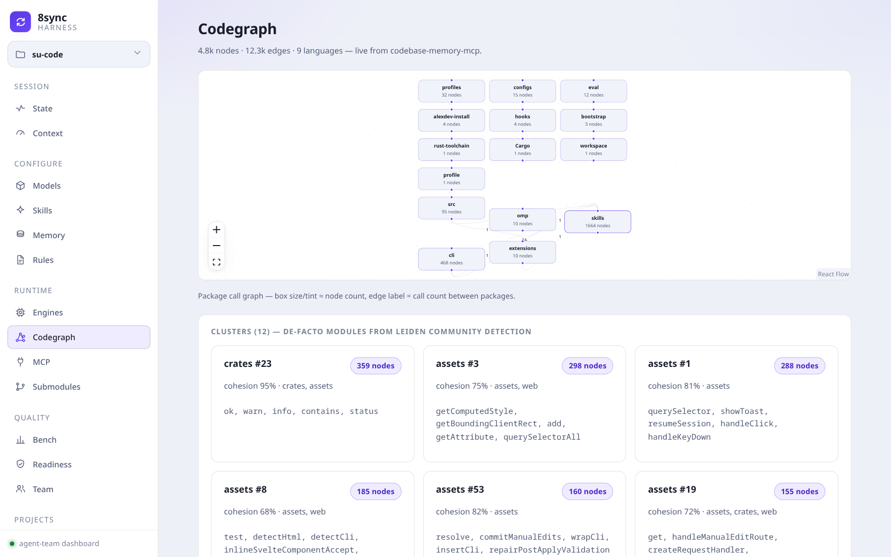
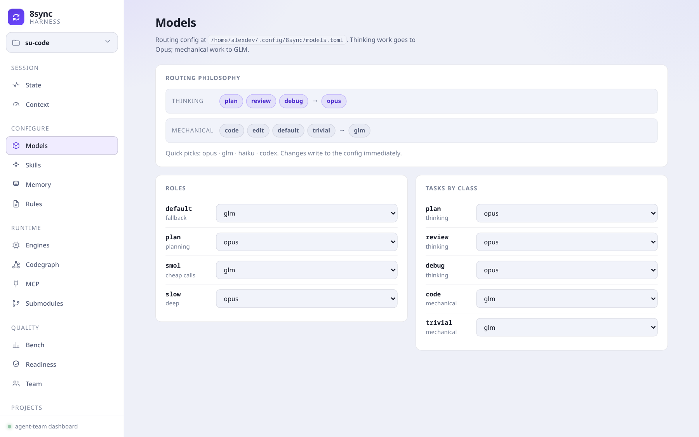

# su-code (`8sync`)

> **VI:** Coding harness terminal-first cho CachyOS/Arch + Kitty + Helix + [omp](https://omp.sh).
> Bạn vẫn dùng terminal như thường ngày; AI agent quan sát ngữ cảnh project, đọc memory `agents/*`, và thực thi lệnh khi bạn yêu cầu.
>
> **EN:** Terminal-first AI coding harness for CachyOS/Arch + Kitty + Helix + [omp](https://omp.sh).
> Keep your normal CLI workflow; AI agents observe project context, load `agents/*` memory, and execute tasks on demand.

---

## Liên kết

- **Website / docs**: <https://8-sync-dev.github.io/su-code> (auto-deploy từ `docs/` qua [`.github/workflows/pages.yml`](.github/workflows/pages.yml))
- **Repo**: <https://github.com/8-Sync-Dev/su-code>
- **Discussions**: <https://github.com/orgs/8-Sync-Dev/discussions>
- **AI engine**: [omp](https://omp.sh) (oh-my-pi) — `8sync` wrap quanh `omp --continue` để giữ session per-project.

> Lưu ý: `8sync` là **coding harness**, không cài desktop environment. Cài Hyprland/Caelestia/HyDE riêng theo upstream của chúng.

---

## TL;DR

```bash
# 1. Cài — one-liner, binary prebuilt (KHÔNG cần git/rust/cargo)
curl -fsSL https://raw.githubusercontent.com/8-Sync-Dev/su-code/main/install.sh | sh
8sync setup                       # cài AI core (omp + codegraph + MCP/skills + gh) — y/N từng profile
8sync doctor                      # verify (tự dọn state cũ nếu có)

# 2. Vào project → dựng harness (1 lệnh, idempotent)
cd <project>
8sync harness                     # skills + codegraph index + AGENTS.md + memory, chạy lại lúc nào cũng được
8sync .                           # mở session (kitty 3-pane + omp)

# 3. Dashboard — theo dõi + CRUD toàn bộ agent-team qua trình duyệt
8sync harness web                 # http://127.0.0.1:8731 — models, skills, memory, rules,
                                  # engines, Codegraph graph, bench, team… sửa trực tiếp, ghi ngay

# Hằng ngày
8sync ai "explain this codebase"  # one-shot prompt; bỏ trống để resume session
8sync ship "feat: ..."            # add + commit + push + gh pr create
```

---

## Cài đặt

### 1. One-liner (khuyến nghị) — tải binary prebuilt

Không cần git, rustup, hay cargo. `install.sh` resolve release mới nhất, tải `8sync-<tag>-linux-x86_64` từ GitHub Releases, đặt vào `~/.local/bin/8sync` (replace bản cũ atomically).

```bash
curl -fsSL https://raw.githubusercontent.com/8-Sync-Dev/su-code/main/install.sh | sh
```

- **Nâng cấp**: chạy lại y hệt, hoặc `8sync up`.
- **Pin version**: `curl -fsSL .../install.sh | SUSYNC_VERSION=v0.12.1 sh`
- **Đổi thư mục cài**: `... | SUSYNC_BIN_DIR=~/bin sh`
- **Gỡ**: `curl -fsSL .../install.sh | sh -s -- --uninstall`

PATH cho `~/.local/bin`, `~/.cargo/bin`, `~/.bun/bin`, `~/.encore/bin` được tự patch vào zsh / bash / fish khi bạn chạy `8sync setup` lần đầu (xem Stage A). Nếu `~/.local/bin` chưa có trong PATH lúc cài, script sẽ in hint.

### 2. Build từ source (contributor) — `scripts/bootstrap.sh`

Dùng khi muốn build từ code (chưa có prebuilt cho arch của bạn, hoặc dev). Cài rustup (nếu thiếu) → `cargo build --release --locked` → copy binary vào `~/.local/bin/8sync`.

```bash
git clone https://github.com/8-Sync-Dev/su-code.git
cd su-code
bash scripts/bootstrap.sh
```

### 3. `8sync setup` — cài phần còn lại

Stage A (harness, luôn idempotent):

- `pacman -S --needed helix lazygit abduco github-cli`
- omp CLI qua `curl -fsSL https://omp.sh/install | sh` (skip nếu đã có)
- ghi config: `~/.config/helix/`, `~/.config/kitty/8sync.session`, `~/.config/8sync/{global,skills}.toml`
- ghi skill (35 bundled) vào `~/.omp/skills/<name>/SKILL.md` + `00-force-load.md`. Always-on: codegraph, karpathy-guidelines, ponytail, assp-skill, impeccable, taste-skill, 8sync-cli, image-routing. On-demand: code-review-and-quality, senior-security, senior-frontend, full-flow, last30days + 18 research skill (`social-growth` opt-in)

Stage B (community profile, opt-in y/N từng cái):

| Profile | Mô tả |
|---|---|
| `dev-stack` | Docker + Node/npm/bun/pnpm + Encore + TS LSP + build chain |
| `nvidia` | Auto-detect GPU family → open-dkms / dkms (skip nếu CachyOS chwd đã cài) |
| `warp` | Cloudflare WARP VPN + DoH + MASQUE (toggle qua `8sync sec`) |
| `bluetooth` | bluez + bluez-utils + service enable (điều khiển qua `8sync bt`) |

Cờ thường dùng:

| Cờ | Hiệu ứng |
|---|---|
| `8sync setup --dry-run` | In plan, không thay đổi gì |
| `8sync setup --no-profile` | Chỉ Stage A |
| `8sync setup --community` | Stage A + dev-stack + bluetooth (không include warp) |
| `8sync setup --profile <name>` | Stage A + apply 1 profile cụ thể |
| `8sync setup profile list \| show <n> \| apply <n>` | Quản lý profile sau setup |

### 3. Update

```bash
8sync up                         # self-update binary (GitHub release) + omp update
```

Hoặc rebuild thủ công từ source:

```bash
cd su-code && git pull
cargo build --release
install -m755 target/release/8sync ~/.local/bin/8sync
```

System packages (`pacman -Syu`) **không** tự chạy — bạn tự quyết khi nào update CachyOS rolling.

---

## Lệnh chính

### Vibe loop (hằng ngày)

| Lệnh | Mô tả |
|---|---|
| `8sync .` | Mở/attach session project hiện tại. Kitty có `allow_remote_control yes` → 3-pane; nếu không → soft 1-pane + `omp --continue` trong abduco |
| `8sync ai [prompt]` | Trống/`continue` → `omp --continue`; có prompt → `omp -p "..."` |
| `8sync find <kw>` | rg/fd + fzf preview → mở editor tại `file:line` |
| `8sync note "msg" [-t tag]` | Append `agents/NOTES.md` |
| `8sync run [dev\|build\|test\|fmt\|lint]` | Project runner theo recipe |
| `8sync ship "msg"` | `git add -A && commit && push && gh pr create` |

### Session quản lý (sub của `.`)

`8sync . ls` / `to <n>` / `new <n> [cmd]` / `rm <n>` / `wipe` / `kick`

### Harness (agent-team bootstrap + dashboard)

| Lệnh | Mô tả |
|---|---|
| `8sync harness` | **Một lệnh (idempotent):** deploy/update bundled skill + codegraph binary + external packs (ponytail/addyosmani, best-effort) → `~/.omp/skills/`, mirror `agents/skills/`, `codegraph init`, seed `agents/*` + `CHANGELOG.md`, inject force-load vào `AGENTS.md`/`CLAUDE.md`. Chạy lại lúc nào cũng an toàn |
| `8sync harness init` | Full bootstrap lần đầu (progress UI) + managed `.gitignore` + gitleaks pre-commit hook. `--force` re-mirror đè hết |
| `8sync harness up` | Refresh state: re-inject + refresh `KNOWLEDGE.md` + re-index codegraph. `--pull` re-pull skill · `--commit` git-commit memory (gitleaks scan trước) · `--loop 10m` (foreground) · `--timer 30m\|off` (systemd user timer, cho nền) |
| **`8sync harness web`** | **Dashboard local** (axum + Vite, `http://127.0.0.1:8731`) — xem & **CRUD** toàn bộ agent-team qua trình duyệt (xem mục Dashboard) |
| `8sync harness gateway [apply\|key <K>\|verify\|status]` | Deploy/verify omp model-gateway (`~/.omp/agent/models.yml`): 9router + `thinking.mode` fix cho claude-sonnet-5. `verify` ping HTTP 200 = healthy |
| `8sync harness add-local-model <path.gguf\|org/repo\|url> [name]` | Load một **GGUF** cục bộ qua **mistral.rs** (Rust, memory-safe) → serve OpenAI endpoint + register thành omp provider `local/<name>`. `list`/`rm <name>` để quản lý. Rồi `8sync ai --model local/<name>` |
| `8sync harness bench` | Đo context budget của loop (upfront vs deferred tokens + KV-cache gate) |
| `8sync harness audit` | Scan docs: stale path / oversized / junk + churn (doc-hygiene) |
| `8sync harness eval [--baseline]` | Chạy quality task-suite qua omp; `--baseline` lưu tham chiếu |
| `8sync harness toolstats` | SQLite tracker: tỉ lệ optimizer (codegraph/cbm/serena) vs fallback (grep/read) + fail/tool |
| `8sync harness compaction [pct]` | Xem/set ngưỡng omp auto-compaction (anti-forget; default 50%) |
| `8sync harness model [k v]` | Xem/edit `~/.config/8sync/models.toml` (routing cho `/auto` + `8sync ai`) |

### Skill system

| Lệnh | Mô tả |
|---|---|
| `8sync skill` | List skill global (`~/.omp/skills/`) + local (`agents/skills/`) |
| `8sync skill add <github-url>` | Clone vào **cả** global + project; **collection-aware** (repo `skills/<name>/` → cài mọi sub-skill, vd `addyosmani/agent-skills`). Rewrite block `<!-- 8sync:skills:* -->` trong `AGENTS.md` |
| `8sync skill add gh:owner/repo` · `<url>@<ref>` · `builtin:<name>` | Short form · pin commit/tag (ghi `rev` vào `skills.toml` = lockfile) · bật opt-in bundled skill (vd `builtin:social-growth`) |
| `8sync skill update [name]` | Re-pull theo `src` (git dedup theo URL, honor `rev` pin) |
| `8sync skill gen <id> <id>` | Fuse N local skill thành 1 SKILL.md tổng hợp |

**35 skill bundled** trong binary. Always-on (đọc theo thứ tự): codegraph → karpathy → ponytail → assp → impeccable → taste → 8sync-cli → image-routing. On-demand: code-review-and-quality · senior-security · senior-frontend · full-flow · last30days + 18 research skill (deep-research, literature-review, autoresearch, paper-writing…). `encore-deploy` tech-gated; `social-growth` opt-in. Idempotent: chạy lại `add` cùng URL → `git pull --ff-only`.


### Lifecycle

| Lệnh | Mô tả |
|---|---|
| `8sync setup` | Cài harness + profile (xem mục Cài đặt) |
| `8sync up` | Self-update binary + `omp update` |
| `8sync doctor` | Health check (kitty remote, omp, helix, gh, configs, profiles, WARP/ufw) |
| `8sync flow` | Workflow help theo thứ tự dùng |
| `8sync help` | Cheatsheet (alias của `8sync` không tham số) |

### AI tooling

| Lệnh | Mô tả |
|---|---|
| `8sync shot <url\|file>` | Render web/file → PNG (cho image-routing skill) |
| `8sync diff-img [ref]` | Git diff → PNG |
| `8sync pdf-img <file>` | PDF page → PNG |

### Security

`8sync sec [on\|off\|toggle\|status]` — bật/tắt cùng lúc Cloudflare WARP VPN + ufw firewall. Sub: `sec warp …`, `sec ufw …`.

### Máy (desktop / dọn dẹp)

| Lệnh | Mô tả |
|---|---|
| `8sync bt [on\|off\|fix\|restart]` | Bluetooth (bluez): status / bật-tắt / troubleshoot adapter chết / restart |
| `8sync clean [--deep\|--ram\|--gpu\|--timer 1h]` | Reclaim disk (paccache/journal/thumbnails) + report CPU/GPU/RAM. `--deep` gỡ orphan; **không** đụng model/cache tải gói |
| `8sync theme [list\|set <name>\|show]` | Đổi palette màu kitty live (chỉ màu, giữ nguyên structure) |
| `8sync bg [set\|list\|add <url>\|search <q>]` | Wallpaper kitty live swap + inline preview; `bg search` = wallhaven.cc (no API key) |

Mọi verb hỗ trợ `-h` / `--help` với block `EXAMPLES` chi tiết.

---

## Dashboard — `8sync harness web`

Một trang web local (axum backend + Vite/React FE, nhúng sẵn trong binary) để **xem và điều khiển toàn bộ agent-team** thay vì sửa file config bằng tay:

```bash
8sync harness web                 # http://127.0.0.1:8731 (tự mở trình duyệt)
8sync harness web --port 9000     # đổi port
8sync harness web --no-open       # không auto-mở (chạy nền / headless)
```

Sidebar gom theo nhóm — mỗi trang đọc **dữ liệu thật** (không mock), phần lớn cho **CRUD ghi thẳng** vào config/memory:

| Nhóm | Trang | Làm được gì |
|---|---|---|
| Session | **State · Context** | Live plan (`agents/STATE.md`), session token/compaction thật |
| Configure | **Models · Skills · Memory · Rules** | Đổi model per-role/task (ghi `models.toml` ngay) · filter + cycle tier 35 skill · edit 6 memory file (STATE/KNOWLEDGE…) · thêm/xoá rule |
| Runtime | **Engines · Codegraph · MCP · Submodules** | Trạng thái engine (codegraph/cbm/headroom/serena/mnemopi) · **graph codebase**: package call graph (elk) + 12 Leiden cluster + symbol search + trace caller/callee · MCP servers · git submodule |
| Quality | **Bench · Readiness · Team** | Chạy `harness bench` live · readiness gate · team roster |
| Projects/Build | **Workspaces · Workflow** | Project switcher · trình dựng pipeline skill/subagent/tool (export ra omp extension) |





---

## Memory project

Khi `8sync .` lần đầu trong project, file/folder sau được seed:

```
<repo>/
├── AGENTS.md                    ← anchor cho mọi AI tool, chứa block force-load skills
└── agents/                      ← memory shared (omp/claude-code/cursor/opencode/aider)
    ├── PROJECT.md               facts cố định (stack, entrypoint)
    ├── KNOWLEDGE.md             append-only: AI học được gì
    ├── DECISIONS.md             append-only: quyết định kiến trúc
    ├── PREFERENCES.md           append-only: style user
    ├── STATE.md                 việc đang dở
    ├── NOTES.md                 quick notes via `8sync note`
    └── skills/                  project-local skills (clone qua `8sync skill add <url>`)
```

`omp` tự quản session memory (`retain` / `recall` / auto-compact) — bạn **không** sửa tay `agents/*.md`. `8sync note` là exception duy nhất (append vào `NOTES.md`).

---

## Documentation site

Trang web tĩnh trong `docs/index.html`, deploy tự động qua GitHub Pages:

- **Source**: [`docs/index.html`](docs/index.html)
- **Workflow**: [`.github/workflows/pages.yml`](.github/workflows/pages.yml) (trigger: push `main` hoặc workflow_dispatch)
- **URL**: <https://8-sync-dev.github.io/su-code>

Sửa `docs/index.html` → push `main` → Pages tự rebuild trong ~1 phút.

---

## Stack & contribute

Rust workspace 1 binary (`8sync` ≈ 5.0 MB stripped — bundle web dashboard FE + 35 skill, nặng nhất `impeccable`). Toolchain pin tại `rust-toolchain.toml`. Web dashboard build từ `web/` (Vite/React) qua `build.rs`, nhúng bằng rust-embed.

Bố cục source:

```
crates/cli/src/
├── main.rs                       clap router
├── ui.rs · env_detect.rs · pkg.rs · assets.rs
└── verbs/                        1 file / 1 verb
    ├── root.rs flow.rs setup.rs doctor.rs up.rs selfup.rs
    ├── here.rs ai.rs ship.rs run.rs find.rs note.rs
    ├── skill.rs shot.rs diff_img.rs pdf_img.rs
    ├── profile.rs sec.rs
assets/                           embed vào binary qua rust-embed
├── configs/                      kitty.session, helix-config, fish-config, 8sync/*.toml
├── presets/                      kitty preset themes
├── skills/                       35 bundled (codegraph, karpathy, ponytail, assp, impeccable, taste, 8sync-cli, image-routing, code-review, senior-security/frontend, full-flow, encore-deploy, last30days, 18 research skill, …)
└── wallpapers/
```

Khi thêm verb mới: tạo `verbs/<new>.rs` với `pub fn run(a: Args) -> Result<()>`, thêm `pub mod <new>;` vào `verbs/mod.rs`, và variant `<New>` + match arm trong `main.rs`.

Smoke test:

```bash
cargo build --release
./target/release/8sync --version
./target/release/8sync help
./target/release/8sync flow
./target/release/8sync doctor
./target/release/8sync skill
./target/release/8sync harness web --no-open   # dashboard → http://127.0.0.1:8731
```

Xem [`AGENTS.md`](AGENTS.md) cho hướng dẫn chi tiết dành cho AI agent / contributor.

---

## License

MIT. See [`LICENSE`](LICENSE).

`#8sync #AIAgent #VibeCoding #omp #CodingHarness #TerminalWorkflow #DeveloperTools #RustLang #KittyTerminal #HelixEditor #ArchLinux #CachyOS #OpenSource`
