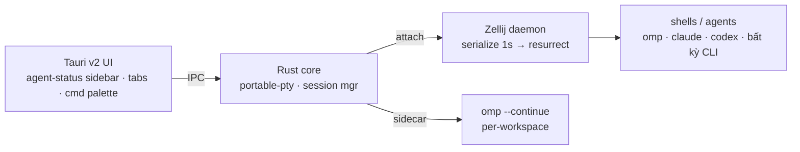

# PLAN — Agent Terminal App (Tauri v2 · omp-native · "cmux cho mọi OS")

> Status: RESEARCHED, chưa build. Deep-research 2026-07-05. Làm sau — đọc file này là đủ context bắt đầu.

## 1. Vision (1 câu)

App terminal quản lý **nhiều phiên AI-coding song song** — mở lại sau reboot vẫn nguyên workspace, omp có sẵn trong từng pane, UI/UX riêng của mình — nhẹ ~10 MB, Linux-first, cross-platform.

## 2. Tại sao NGAY BÂY GIỜ (trend window — bằng chứng)

| Tín hiệu | Số liệu (verified 2026-07) | Nguồn |
|---|---|---|
| **cmux** (terminal cho AI agents) | launch 2/2026 → **22.3k GitHub stars trong 4 tháng**, YC launch | github.com/manaflow-ai/cmux · cmux.com |
| cmux **macOS-only** (Swift+AppKit+libghostty), Linux/Windows = waitlist | → **khe hở cross-platform đang mở** | cmux.com |
| Tiêu chí terminal 2026 đã đổi | "không còn chấm font/tốc độ — chấm: chạy N agents cùng lúc, thấy ngay agent nào working/stuck/finished" | agentsroom.dev |
| Warp 2.0 rebrand "Agentic Development Environment" | AI-terminal = table stakes, nhưng Warp **đóng + trả phí** | termdock.com |
| Coding agent sessions | 4 phút → 23 phút avg; 57% org chạy multi-step agent workflows | fungies.io 2026 |

**Kết luận positioning:** "cmux for Linux + every OS, omp-native, GPL-free" — ride đúng wave cmux đã chứng minh, ăn phần cmux chưa phủ. Trend kiểu TikTok = có **format đã viral sẵn** (agent-parallel terminal) + **twist mới** (cross-platform + nhẹ 10× + omp brain).

## 3. Stack (đã research, chốt — không cần bàn lại)

| Layer | Chọn | Vì sao (số liệu) |
|---|---|---|
| Shell app | **Tauri v2** (v3 chưa đáng đặt cược) | bundle ~8 MB vs Electron 165 MB; start <0.5s; idle RAM 30–40 MB (Hoppscotch migrate: −96% size, −70% RAM) |
| Render | **xterm.js + WebGL addon**; nếu đụng trần perf → pattern **maiTerm**: `alacritty_terminal` crate parse VTE phía Rust, xterm.js chỉ là thin viewport renderer ~60fps | VS Code dùng xterm.js; maiTerm chứng minh hybrid pattern |
| PTY | **`portable-pty`** (crate của WezTerm) | full PTY semantics, async multi-shell, battle-tested |
| **State/persistence** | **Zellij làm backend daemon** (app = UI attach vào mux server) | serialize mỗi 1s → **restore layout + tabs + cwd + command sau reboot**; viewport/scrollback serialization configurable; layout = KDL human-readable (share được) |
| AI brain | **omp sidecar** (Tauri sidecar bundle binary) + pane mặc định `omp --continue` | conversation state của omp = phần "đang code dở" sống qua reboot, mạnh hơn mọi process-freeze |
| Cùng họ đã có | Terminon (Tauri+React) · **Terax ~7-8 MB ADE** · maiTerm (Tauri+Svelte5) | mỏ code tham khảo, chưa cái nào có mux-backend + agent-status UX |

**Sự thật kỹ thuật phải nhớ:** không gì giữ process sống qua power-off (CRIU fragile, bỏ). Chuẩn ngành = **resurrection** (layout+cwd+command re-run, Zellij có "Press ENTER to run"/`--force-run-commands`). Với agent workflow thì resurrection + `omp --continue` = trải nghiệm "vẫn còn nguyên".

## 4. Kiến trúc

- **UI không sở hữu state** — Zellij sở hữu. App crash/upgrade không mất gì.
- **Agent-status sidebar** = feature #1 (học cmux): mỗi pane có ring/badge — working (spinner) / **waiting-for-you** (sáng đèn) / done / stuck. Nguồn tín hiệu: parse output im lặng N giây + omp hook.
- CLI + Unix socket cho mọi action (học cmux: scriptable = agents tự điều khiển app).

## 5. MVP (phase — làm tuần tự, mỗi phase ship được)

1. **Skeleton (3-5 ngày):** Tauri v2 + xterm.js WebGL + portable-pty, N tabs/splits, config KDL. Đích: mở 10 pane, htop mượt.
2. **Persistence (1 tuần):** Zellij attach/detach backend; đóng app → mở lại nguyên workspace; reboot → resurrect (banner ENTER). Đích: demo "tắt máy mở lại vẫn còn" quay video được.
3. **omp-native (1 tuần):** sidecar omp, pane agent mặc định, `/model` picker hoạt động, badge waiting/done từ omp events. Đích: chạy 3 agent song song, sidebar thấy ngay ai cần mình.
4. **Polish + viral loop (1-2 tuần):** cmd palette, theme, share-layout (export KDL 1 click), 1-line install script, demo clips.

Non-goals MVP: Windows (sau), settings UI phức tạp, plugin system, browser pane.

## 6. Trend mechanics (kiểu TikTok — format viral có sẵn + twist)

- **Hook 3 giây:** video 8 pane agent chạy song song, sidebar nhấp nháy "2 waiting for you" → click → trả lời → next. Đây là shot đã làm cmux viral; twist của mình: **chạy trên Linux + máy yếu (8 MB app)**.
- **1-line install** (`curl | sh`) — friction = 0, giống 8sync.
- **Share-layout** = share-able artifact (KDL file như preset TikTok — người xem copy được "setup của mày").
- **Launch playbook:** demo clip (X/Reddit r/unixporn + r/LocalLLaMA) → Show HN → Product Hunt; tag "open-source Warp/cmux alternative, Linux-first". Mốc cmux chứng minh: format này cho 20k+ stars/4 tháng nếu đúng khe.
- **Không copy code cmux** (GPL-3.0) — chỉ học UX pattern. Stack mình MIT-clean toàn bộ.

## 7. Rủi ro + đối sách

| Rủi ro | Đối sách |
|---|---|
| Zellij resurrection có bug reliability (issues #4641/#4129 đầu 2026) | pin version đã test; smoke test resurrection trong CI; fallback: tự serialize registry TSV kiểu 8sync local-models |
| xterm.js đụng trần khi scrollback lớn | maiTerm pattern: VTE parse Rust-side (alacritty_terminal), xterm.js chỉ render viewport |
| WebKitGTK quirks trên Linux (Tauri dùng webview hệ thống) | test sớm trên Arch/CachyOS + Fedora; WebGL addon là bắt buộc, không dùng DOM renderer |
| cmux ship Linux trước mình | tốc độ = moat duy nhất → MVP 1 tháng; omp-native + 8sync harness là differentiator họ không có |
| Rust learning curve cho contributor | giữ core nhỏ; UI đón contributor JS/Svelte |

## 8. Success metrics

- Perf: cold start <0.5s · idle RAM <60 MB (app, chưa tính shells) · bundle <15 MB · 10 pane 60fps.
- Resurrection: 100% layout+cwd restore sau reboot (CI test); omp conversation resume 100%.
- Trend: 1k stars tháng đầu (proxy khe còn mở); 1 demo clip >100k views.

## 9. Next actions (khi bắt đầu)

1. `cargo create-tauri-app` skeleton + xterm.js WebGL + portable-pty echo shell — 1 buổi.
2. Spike Zellij: `zellij attach --create` từ Rust, kill app, re-attach — chứng minh vòng đời state trước khi viết UI.
3. Đọc kỹ: cmux README (UX patterns) · maiTerm src (alacritty_terminal bridge) · Zellij session-resurrection docs.
4. Đặt tên + đăng ký org repo (gợi ý hướng: thuộc họ 8sync/omp, vd "synterm" / "ompterm" — quyết sau).
5. Dùng chính su-code làm harness: `8sync harness` trong repo mới ngay từ commit đầu.

## Sources (deep-research 2026-07-05)

- cmux: github.com/manaflow-ai/cmux · cmux.com · YC launch 3/2026 · 22.3k stars 6/2026 (vibecoding.app review)
- Zellij resurrection: zellij.dev/documentation/session-resurrection.html (serialize 1s, viewport/scrollback opts, ENTER banner, post_command_discovery_hook)
- Tauri vs Electron 2026: tech-insider.org (−96% size, −50% RAM) · Hoppscotch 165→8 MB, −70% RAM
- Tauri terminal prior art: marc2332/tauri-terminal · Shabari-K-S/terminon · Terax (7-8 MB ADE) · Flexmark-Intl/maiterm (alacritty_terminal + xterm.js hybrid)
- Trend 2026: agentsroom.dev (agent-visibility là tiêu chí #1) · termdock.com (Ghostty 4× render, Warp 2.0 ADE) · fungies.io (57% multi-agent prod, session 4→23 min)
