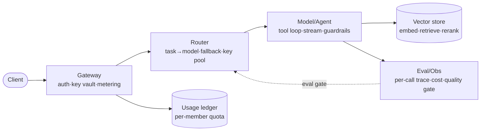

# AI Microservice Design

A design + guardrail skill. It does **not** write a full reference
implementation — it produces the *architecture* and the *eval gate* that make
an AI feature safe to ship. Load-bearing canon: `skill://ai-microservice-design/references/base.md`.
Real, mined shape: `skill://ai-microservice-design/references/patterns.md`.

## When to use

- Adding any AI capability to a service: gateway/router, RAG, agent loop,
  per-member keys + metering, LLM tracing, or an eval gate.
- "We need an LLM feature" with no topology yet — map owners before coding.
- A model/prompt change shipped and silently regressed quality → retrofit a gate.
- Onboarding a new provider/model and wiring multi-provider routing.
- A fullstack AI feature (FE → BE → model) needs the AI slice placed.

## When NOT to use

- Picking the single "best" vector DB or provider — this skill presents
  **tradeoffs + a migration trigger**, never a winner (see Non-goals).
- Training / fine-tuning / dataset-curation workflows — out of scope.
- Writing the full reference implementation — this is design + guardrails.
- A one-off script calling one model with no auth/metering/eval need.

## Procedure

> Before designing: read `references/base.md` (the chuẩn base) and
> `references/patterns.md` (the real 8syncdev shapes). Design extends both —
> never invent a second convention beside an existing one.

### 1. Ground in the EXISTING topology — never design in a vacuum

Map what already runs before adding to it:

- `codegraph` / `mcp__codebase_memory_mcp_get_architecture` — service graph,
  packages, cross-service calls. Note the **clusters**: which service owns
  auth, which owns data, where model calls already happen.
- `mcp__codebase_memory_mcp_trace_path` (mode `cross_service`) — follow a live
  request: client → gateway → router → model → vector store. Find the gaps
  (a concern with no owner, a model call with no trace).
- `mcp__serena_find_symbol` / `get_symbols_overview` — locate the existing
  auth boundary, key store, and any model-call site to extend, not duplicate.
- If the repo is the control-plane pattern (`gate`/`core`/`shared`), confirm
  the envelope convention (`{success,message,result}`) before adding endpoints.

Record findings in `su-code/DECISIONS.md` (or the repo's DECISIONS) as the
"current state" header. Design adds to this, it doesn't replace it.

### 2. Produce the topology diagram + ownership table

Emit a mermaid diagram with **every concern owning-named**. Five owners:

State **where each concern lives** (which service/boundary owns auth, metering,
model calls, retrieval, eval). If two owners collapse into one process, call
it out as a deliberate, temporary choice with a split trigger.

### 3. Define the model abstraction boundary

One provider-agnostic interface (the `ChatModel`/`ResolvedModel` shape from
`patterns.md` §B). Decisions to nail down:

- **Routing input:** task + complexity hint + tenant override (NOT provider
  name). Dispatch by `api_flavor` (openai-compatible vs native), not vendor.
- **Key vaulting invariant:** upstream keys encrypted at rest, decrypted only
  inside the proxy call. Members get **per-member keys** — upstream keys are
  **never handed out**. (ai-router-hub invariant.)
- **Failover + circuit breaker:** key pool with a short TTL invalidated on 429;
  `deadModels`/dead-provider marking.
- **Timeouts:** cap every chat-completion (eino-ext openai defaults to *no*
  timeout — a hung upstream hangs the worker).

Validate the interface against ≥2 providers with `mcp__codebase_memory_mcp_search_code`
before committing — confirm no provider-specific type leaks into the agent loop.

### 4. Place auth + metering

- **Per-member keys:** minted by the gateway, stored as a **hash** (raw key
  never persisted). **Revocation = status flip, never a delete** (the usage
  ledger must keep pointing at a real member).
- **Metering:** record input+output tokens, model, latency, status per call.
  Enforce quota **before** the call (today's spend vs. per-member daily limit).
  A failed upstream turn **stays in the ledger with its status**.
- **Limits:** per-key rate (req/min) + per-member cost (tokens/day or $/day).
- Where it already exists, extend it: `mcp__serena_find_referencing_symbols`
  on the auth handler to find every call site that must adopt the new key path.

### 5. Place the RAG slice (if retrieval is in scope)

Decide and write down: chunking strategy + size, embedding model + dimensions,
vector store + **migration trigger** (pgvector while ≤10M vectors **and**
p95 ≤ 200ms; flip when either trips), hybrid retrieve (dense+sparse →
canonical dedup → 1-hop expand), rerank (knob-gated, **fail-open**). Use
`mcp__codebase_memory_mcp_query_graph` to confirm the retrieve path doesn't
duplicate an existing search.

### 6. Place the agent slice (if tool-use is in scope)

- **Graph, not free function** (LangGraph/Eino): model → tools → model, with
  state inspectable.
- **Streaming:** typed SSE frames `rag | tool | token | done | error`; stream
  the first token early, but the **final envelope/guardrail verdict is
  authoritative**, not the streamed draft.
- **Guardrails:** deterministic, in-loop, checked against **ground truth**
  (actual tool calls), not prose regex. One coached retry → safe fallback.
- Pre-ground context to avoid paying a ReAct round-trip for bytes already in
  the prompt.

### 7. Define the eval gate (BEFORE shipping any model change)

The thing that prevents silent regressions. Write into `DECISIONS.md`:

1. **Eval set:** curated representative inputs with expected behaviour
   (rubric-graded for open-ended, exact/regex for structured).
2. **Threshold:** a numeric pass bar (e.g. mean ≥ 0.85, no case < 0.6) set
   **before** the change.
3. **Gate rule:** a model/prompt/routing change below threshold **does not
   ship**, even with green unit tests. Mandatory when multi-LLM routing is in play.

### 8. Observability — trace every model call

- One trace record = **one upstream provider request inside the agent loop**,
  not one outer turn. Capture model name, key id, latency, status, usage, tool
  calls, RAG docs, guardrail verdict.
- Wire the `TraceTurn`-shaped record (patterns.md §D) as the single source of
  truth for cost ($/turn, $/member), latency (p50/p95/p99), quality (eval pass
  rate), error rate by provider/model. OpenLLMetry for vendor-neutral OTEL;
  Langfuse/Braintrust for eval + prompt/version mgmt.

### 9. Record decisions + run the build loop

- Write each load-bearing decision as an **ADR** in `su-code/DECISIONS.md`
  (or `docs/adr/`): the vector-store trigger, the routing policy, the eval
  threshold, the key-vaulting invariant. `mcp__codebase_memory_mcp_manage_adr`
  can index them into the graph.
- Use `engine_*` for the build loop: `engine_plan` slices the work; each task's
  **verify = service tests AND eval-pass threshold** (`engine_verify`), not
  tests alone. `engine_advance` refuses a task whose verify hasn't passed.
- Smoke-test live behavior with `browser` (fullstack) or a curl against the
  gateway; confirm a trace record appears for the call.

## Acceptance check

The design is done when ALL hold:

- [ ] A **mermaid topology** with every concern **owning-named** (gateway /
      router / model-agent / vector store / eval-obs) and a one-line "lives in
      `<service>`" per box.
- [ ] The **per-member key + metering invariant** is explicit: keys hashed,
      revocation = status flip, upstream keys never handed out, quota enforced
      before the call, failed turns retained in the ledger.
- [ ] A **provider-agnostic model interface** with routing by task/flavor
      (not vendor) and a key-pool circuit breaker.
- [ ] An **eval gate** with a named eval set **and** a numeric pass threshold,
      recorded as a gate rule (below threshold = no ship).
- [ ] **Trace coverage on every model call** (per-upstream-request, not per
      turn), feeding cost/latency/quality dashboards.
- [ ] Decisions recorded as **ADRs** in `su-code/DECISIONS.md`.

## Non-goals

- Picking a single vector DB / provider / model as "best" — present tradeoffs
  and a **measured migration trigger** instead.
- Training, fine-tuning, or dataset-curation pipelines.
- A full, runnable reference implementation — this skill ships the design and
  the guardrails; implementation is separate work.
- Reimplementing omp behavior — every tool call above composes omp-native
  primitives; when omp upgrades a primitive, this skill inherits it.
