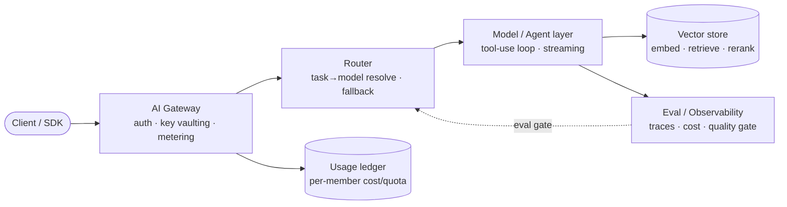

# Base — AI Microservice Design (chuẩn base)

This is the canonical upstream the skill extends from. There is no single
framework that "is" an AI microservice; the chuẩn base is an assembled set of
**patterns and tool categories** that every serious AI backend converges on.
Distil the load-bearing decisions here; do not vendor a README.

> Versions move fast — the *categories* below are stable, the *numbers* are a
> 2026-08 snapshot. Re-check before pinning.

## 1. Topology — the one diagram everything else fits into

Five concerns, five owners. The single most common mistake is collapsing two
owners into one process and then being unable to evolve them independently.

| Concern | Owns | Must NOT do |
|---|---|---|
| **Gateway** | auth, per-member keys, rate/cost limits, usage ledger | call models directly, know provider names |
| **Router** | task→model resolution, provider fallback, key pool | hold member identity, persist usage |
| **Model/Agent** | tool-use loop, streaming, guardrails, prompt assembly | decide which provider/key (router's job) |
| **Vector store** | embed, retrieve, rerank, chunk lifecycle | run the agent loop |
| **Eval/Obs** | traces per model call, cost/latency/quality, eval gate | mutate production traffic |

## 2. AI Gateway / Router

The gateway is an **OpenAI-compatible proxy** in front of many upstreams. One
endpoint, one auth model, one meter — clients never see provider differences.

- **LiteLLM** (`docs.litellm.ai`, stable **v1.95.0** Aug 2026, weekly Sunday
  releases, rolling support for the last 4 minor lines; pin a tag, the
  `main-stable` Docker tag is deprecated) — the reference proxy: 100+ provider
  adapters behind one `/chat/completions`, virtual keys, spend tracking,
  fallbacks, retry/fallback policies. `github.com/BerriAI/litellm`.
- **Portkey** (`docs.portkey.ai`) — gateway + caching + routing + observability
  as a product; the "config-first routing" concept comes from here.
- **OpenAI-compatible shape is the contract.** Error bodies are OpenAI-shaped
  (`{error:{message,type,code}}`) because every client already parses them.

**Load-bearing decisions:**
- *Where state lives:* the gateway owns the **usage ledger** and **key
  registry**; it must NOT own model logic.
- *Key vaulting invariant:* upstream provider keys are encrypted at rest and
  decrypted only inside the proxy call. Members receive **per-member keys**
  minted by the gateway — upstream keys are **never handed out**.
- *Routing policy:* start dumb (first healthy provider that claims the model).
  Add weights/health/failover only when asked — a wrong routing guess is
  expensive to unwind.

## 3. RAG — chunking, embedding, vector store, retrieval + reranking

- **Embeddings:** OpenAI `text-embedding-3-large` (3072-d, MRL-truncatable to
  1536/1024/512), Voyage AI (strong for non-English), Cohere embed-multilingual.
- **Vector stores:**
  - **pgvector** (`github.com/pgvector/pgvector`, **0.8+**, HNSW index,
    `m=16 ef_construction=64`, recall@10 ≥ 0.95) — same DB as app data →
    transactional insert (`BEGIN; INSERT row; INSERT embedding; COMMIT;`),
    JOIN with business tables, no cross-system sync. Ceiling: HNSW build is
    O(N log N), heavy vacuum, shared connection pool.
  - **Qdrant** (`qdrant.tech`, Rust payload filtering, gRPC, horizontal scale).
  - **Pinecone Serverless** (`pinecone.io`, pay-per-op, `aws-ap-southeast-1`,
    distributed namespaces, auto-scale, **no distributed transactions**).
- **Retrieval:** **hybrid** = dense (vector) + sparse (BM25/tsv) seeds, then
  promote child chunks to canonical parent, then 1-hop graph expansion, one
  card per entity. GraphRAG pattern.
- **Reranking:** GraphRAG optimises *recall*; a reranker (Cohere Rerank v3
  multilingual, or a small LLM scoring candidates) optimises *precision*.
  Knob-gated, **fail-open**: on resolve/model/parse/timeout error, keep the
  graph-score order and cut top-K — never block the turn.

**Load-bearing decision — *which vector store* is a migration-triggered
choice, not a religion:** pgvector while vectors ≤ 10M **and** query p95 ≤
200ms; flip to Pinecone/Qdrant when either trigger trips. This is the
single most-repeated AI-infra ADR — see `8syncdev/8syncdev-pro-v2:docs/adr/ADR-006`.

## 4. Agent orchestration — graph, tool-use loop, streaming

- **Graph-based orchestration:** **LangGraph** (`langchain-ai/langgraph`,
  Python/JS, state machine over nodes/edges, checkpointing) and **Eino**
  (`github.com/cloudwego/eino`, Go, stable **v0.9.13** Aug 2026; `eino-ext`
  for provider components; `flow/agent/react` ReAct loop) — the agent is a
  **graph of nodes** (model → tools → model), not a free function. State and
  control flow are inspectable and replayable.
- **Tool-use loop (ReAct):** model emits tool calls → engine executes → feeds
  results back → model replies. Cap iterations; pre-ground context to avoid
  paying a second ReAct round-trip for bytes already in the prompt.
- **Streaming:** SSE frames typed `rag | tool | token | done | error`; stream
  the first meaningful token early (UX), but the **final envelope/guardrail
  verdict** is the authoritative record, not the streamed draft.
- **Guardrails:** deterministic, in-loop, checked against **ground truth**
  (actual tool calls, working memory) — not prose-regex sanitizers. A
  violation → **one** coached retry → safe fallback. Claims the model makes
  about what it did are validated against the *actual* tool-call log.

## 5. Auth + metering

- **Per-member / per-tenant keys** minted by the gateway. The raw key is
  **hashed** for lookup; only the hash is stored. **Revocation is a status
  flip, never a delete** — the usage ledger must keep pointing at a real
  member after access is taken away.
- **Metering:** every model call records input+output tokens, model, latency,
  status. Quota is enforced **before** the call (today's spend vs. per-member
  daily token limit), resets at a boundary (UTC midnight). A failed upstream
  turn **stays in the ledger with its status** — never vanishes into a clean
  table.
- **Rate/cost limits:** per-key rate (req/min) + per-member cost (tokens/day
  or $/day). 429 from an upstream invalidates that key in the pool for a short
  TTL (circuit-breaker), so the router stops hammering a bad key.

## 6. Observability for LLMs — traces, eval, prompt/version mgmt

- **Tracing per model call (not per turn):** one trace record = one upstream
  provider request *inside* the agent loop, not one outer `Agent.Generate`.
  Capture model name, key id, latency, status, usage, tool calls, RAG docs,
  guardrail verdict.
- **OpenLLMetry** (`traceloop.com/openllmetry`, OTEL semantic conventions for
  LLMs) — vendor-neutral auto-instrumentation of model calls into OTEL.
- **Langfuse** (`langfuse.com`, self-host **v4** GA Aug 2026,
  observations-first ClickHouse model; needs ClickHouse 25.12+, Postgres 16,
  Redis 7.2; v3 security-patched to Jan 2027) — traces + prompt/version
  management + **eval** (human + LLM-as-judge + datasets). The all-in-one.
- **Braintrust** (`braintrust.dev`) — eval + prompt playground + datasets,
  CI-friendly "does this change regress quality?" gating.
- **Dashboards:** cost ($/turn, $/member), latency (p50/p95/p99), quality
  (eval pass rate), error rate by provider/model.

## 7. Eval-as-gate (the thing that prevents silent regressions)

A model swap or prompt change can *look* fine and quietly break output. The
defense is a **golden eval set** run as a gate:

1. Curate a dataset of representative inputs with expected behaviour
   (rubric-graded for open-ended tasks, exact/regex for structured).
2. Define a **pass threshold** (e.g. ≥ 0.85 mean score, no individual case
   below 0.6) **before** shipping.
3. Run the eval on every model/prompt change. A change that drops below
   threshold **does not ship**, even if unit tests are green.

Routing bugs serve the wrong model → quality regression. **Eval on every
change is mandatory** when multi-LLM routing is in play.

## 8. Control-plane vs data-plane

- **Control-plane** (e.g. Encore Go/TS): orchestrates *lifecycle* — app/agent
  registration, key provisioning, model config, health, deploy. Declarative
  infra (DB, PubSub, Cron, Secrets, Cache declared in code).
- **Data-plane**: the gateway/router/agent path that serves live traffic.
- Envelope convention for control-plane APIs: `{success, message, result}` —
  HTTP errors go through the framework's typed error path; a 200 with
  `success:false` is a handled business failure.

---

**The five load-bearing decisions, restated:**
1. **Model abstraction boundary** — one provider-agnostic interface; routing is
   a separate concern from the agent loop.
2. **Where state lives** — gateway owns keys+ledger; vector store owns chunks;
   eval owns the gate. Never collapse two owners.
3. **Sync vs streaming** — stream tokens for UX; the envelope/guardrail verdict
   is authoritative.
4. **Eval-as-gate** — threshold defined before shipping; no change ships below
   threshold.
5. **Key vaulting** — upstream keys never leave the proxy; members get
   per-member keys.
