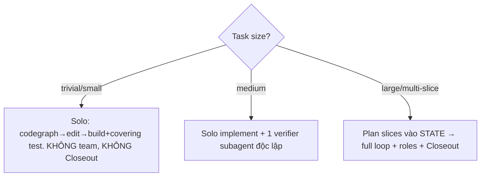
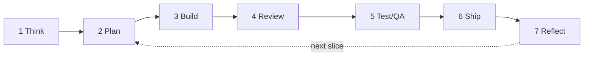

# Plan — Agent-Team Workflow Automation (dùng skills chuẩn vào su-code)

**Date:** 2026-06-25 · **Scope:** cách **dùng** các skill chuẩn tốt (gstack · gsd-pi · ponytail · headroom · codegraph/cbm + bộ engineering packs) để vận hành su-code như **một team agent tự động** — không phải xây mới, mà compose đúng cái đã có vào một pipeline workflow.
**Trạng thái:** OPERATING PLAN — phần lớn machinery đã ship (v0.23.0 `/gs` + harness); plan này định nghĩa *cách dùng* + chỉ ra gap đáng đóng.

---

## 0. Một câu (thesis)

> **gstack = team 23 chuyên gia bật ra tay bằng 23 slash-command. su-code đã *distill* nguyên cái team đó vào MỘT lệnh `/gs` biết tự right-size + một harness loop kiểu gsd-pi.** Plan này là sách vận hành: map từng "vai" của team về skill/subagent đã có, ráp thành pipeline Think→Plan→Build→Review→Test→Ship→Reflect, và nói rõ chỗ nào **cố ý KHÔNG** clone gstack (ponytail: right-size > 23-command).

Nguyên tắc bất biến (kế thừa `outputs/harness-loop-engineering-v2-plan.md:16`): *inject DEFAULT + ENFORCEMENT, không inject thêm CONTEXT.* Một team mạnh = ép dùng đúng tool + đúng vai, **không** = nhồi 23 command vào prefix.

---

## 1. Dàn diễn viên — skill chuẩn là gì, đóng vai gì

| Skill / engine | Bản chất | Vai trong team | Nguồn |
|---|---|---|---|
| **gstack** (`reference/gstack`) | 23 specialist + 8 power-tool, sprint Think→Plan→Build→Review→Test→Ship→Reflect, mỗi skill feed skill kế | **Bản thiết kế team** — ta học cấu trúc vai + pipeline | `github.com/garrytan/gstack` |
| **gsd-pi** (`reference/gsd-pi`) | Local-first agent: milestone/slice/task · auto mode · worktree isolation · `.gsd/` memory · verify:fast/pr/merge | **Bản thiết kế loop** — slice + auto + worktree + memory spine | `github.com/open-gsd/gsd-pi` |
| **`/gs`** (`agents/skills/gs/SKILL.md`, `.omp/commands/gs.md`) | Lead arg-routed: `<goal>`/resume/`auto`/`status`/`next`/`stop`, right-size FIRST | **CEO + Eng-Manager (lead/orchestrator)** | đã ship v0.20–0.23 |
| **ponytail** (CORE) | Laziest-that-works, YAGNI, xoá>thêm, intensity lite/full/ultra | **Phanh chống over-build** — quyết "vai này có cần tồn tại không" | `agents/skills/ponytail/SKILL.md` |
| **karpathy-guidelines** (CORE) | Small steps, declarative, chống 4 failure mode | **Kỷ luật của mọi vai** | `agents/skills/karpathy-guidelines/SKILL.md` |
| **codegraph** (CORE) + **codebase-memory-mcp** | Code intelligence local + MCP semantic graph | **Giác quan chung** — STEP 0 mọi vai trước khi đọc/sửa | `codegraph/SKILL.md`; `deploy.rs` |
| **headroom** (MCP: `compress`/`stats`/`retrieve`) | Nén output >~50 dòng 60–95% trước khi vào context | **Bộ lọc token** — bắt buộc cho mọi log/diff/test dump | `deploy.rs:310-331` |
| Engineering packs (on-demand) | spec-driven · planning · tdd · code-review · senior-security · senior-frontend · full-flow · ci-cd · debugging · documentation · performance · observability | **Tủ kỹ năng** vai mượn khi task khớp | `agents/skills/*` |

---

## 2. Roster — vai ↔ skill ↔ subagent ↔ khi nào bật

su-code có sẵn subagent types: `explore` (read-only scout) · `plan` · `designer` · `reviewer` · `librarian` · `oracle` (senior/2nd-opinion) · `task` · `quick_task`. Map team gstack về đây:

| gstack specialist (`/cmd`) | su-code realization | Subagent | Skill mượn |
|---|---|---|---|
| YC Office Hours `/office-hours` | `/gs <goal>` §1 challenge scope | lead (solo) | `idea-refine` |
| CEO `/plan-ceo-review` · `/autoplan` | `/gs` plan phase (right-size + DoD) | lead / `plan` | `planning-and-task-breakdown` |
| Eng Manager `/plan-eng-review` | plan phase: data-flow/edge/test matrix | `plan` | `spec-driven-development`, `api-and-interface-design` |
| Spec author `/spec` | spec trước build cho feature lớn | `plan` | `spec-driven-development` |
| Senior Designer `/plan-design-review`·`/design-review` · Design Eng `/design-html` | UI plan + audit + build (xem §4b) | `designer` | **impeccable** + **clouds-f** (+ `taste`) |
| Design Partner `/design-consultation` | design system from scratch | `designer` | impeccable |
| DX Lead `/plan-devex-review`·`/devex-review` | API/CLI/docs ergonomics | `designer`/`reviewer` | `senior-frontend`, `api-and-interface-design` |
| Staff Eng `/review` | review tìm bug lọt CI | `reviewer` | `code-review-and-quality` |
| Debugger `/investigate` | root-cause, no-fix-without-investigation | `oracle`/lead | `debugging-and-error-recovery` |
| QA Lead `/qa` | browser-drive UI + đọc trace, gen regression test | `task` (verifier) | **full-flow**, `browser-testing-with-devtools` |
| CSO `/cso` | OWASP+STRIDE audit | `reviewer`/`oracle` | `senior-security`, `security-and-hardening` |
| Release Eng `/ship` | sync→test→push→PR | lead | `8sync ship`, `git-workflow-and-versioning`, `shipping-and-launch` |
| Land & deploy `/land-and-deploy`·`/canary` | merge→CI→verify prod | lead | `ci-cd-and-automation`, `observability-and-instrumentation`, `encore-deploy`* |
| Perf `/benchmark` | baseline + before/after | `task` | `performance-optimization` |
| Tech Writer `/document-release` | doc theo diff + Diataxis | lead | `documentation-and-adrs` + `8sync harness audit` |
| Retro `/retro` · Memory `/learn` | KNOWLEDGE/PLAYBOOKS/DECISIONS + cbm | lead | harness memory (STATE/KNOWLEDGE/PLAYBOOKS) |
| 2nd opinion `/codex` | cross-model review | `oracle` | — |
| Browse `/browse` | real Chromium | omp `browser` tool | `browser-testing-with-devtools` |

\* `encore-deploy` chỉ bật khi project dùng Encore (tech-gated).

**Đọc bảng này thế nào:** `/gs` là lead duy nhất giữ context + ra quyết định. Các vai khác **chỉ vật chất hóa thành `task` subagent khi task đủ lớn** (§3). Vai = (subagent type) + (skill body nạp khi trigger), KHÔNG phải 23 lệnh người gõ tay.

---

## 3. Right-size gate — quyết mức team TRƯỚC (quan trọng nhất)

Kế thừa `.omp/commands/gs.md:15-21`. Ép `/gs` phân loại trước mọi việc:

- **Team là EXCEPTION phải biện minh**, không phải default. Overhead phối hợp > tự làm = regression (ponytail).
- Delegate `task` subagent CHỈ khi: parallel độc lập · cần isolate context nặng · cần specialization lead thiếu. Giao **objective + boundary + summary-return**, không "research X", không inline transcript (`.omp/commands/gs.md:26-27`).

---

## 4. Pipeline workflow automation (the sprint)

Một slice chạy qua 7 trạm; mỗi trạm có owner + tool cụ thể. `auto` mode không yield giữa các trạm.

| # | Trạm | Owner | Làm gì | Tool/skill | Gate ra trạm sau |
|---|---|---|---|---|---|
| 1 | **Think** | lead | challenge framing, tìm "10-star" ẩn trong request | `idea-refine` | scope chốt (1 dòng) |
| 2 | **Plan** | lead/`plan` | DoD + slice checklist nhỏ-nhất-trước vào `agents/STATE.md`; design review nếu có UI | `planning-*`, `spec-driven-*`, impeccable | STATE có Goal+DoD+Checklist |
| 3 | **Build** | lead/implementer | hiểu history trước (git log/blame + DECISIONS + cbm), code right-sized | codegraph, ponytail, karpathy | diff nhỏ-nhất chạy được |
| 4 | **Review** | `reviewer`/`oracle` | bug lọt CI, completeness gap, (security → `senior-security`) | `code-review-and-quality` | review pass / auto-fix |
| 5 | **Test/QA** | verifier `task` | **verify-gate độc lập**: build + test phủ thay đổi + **thêm** test hành vi mới; UI → browser drive + đọc trace + **Lighthouse 4-gate** (§4b) | **full-flow**, `tdd`, `browser-*`, impeccable | `validated` + Lighthouse pass (không weaken test) |
| 6 | **Ship** | lead | commit slice (gitleaks scan); `8sync ship` chỉ khi user yêu cầu | `8sync ship`, `git-workflow-*` | commit/PR sạch |
| 7 | **Reflect** | lead | tick STATE · `failure:`/`validated:` vào KNOWLEDGE · distill `validated` → PLAYBOOKS (`When:`) · **doc-hygiene** `8sync harness audit` | harness memory, `documentation-*` | spine cập nhật, doc honest |

**Mỗi skill feed skill kế** (như gstack): Plan ghi DoD → Test đọc DoD; Review tìm bug → Ship verify đã fix; Reflect sinh PLAYBOOK → Plan slice sau retrieve được.

---
## 4b. UI/UX Design Lane — chuẩn frontend (impeccable + Clouds F + Lighthouse)

Slice chạm UI/UX → trạm Plan→Build→Review→Test chạy theo lane này (chuẩn `frontend-agent-workflow.md`). **Design skill là ưu tiên CAO NHẤT cho task UI.**

**Agent/skill:**
- **impeccable** (bundled always-on SPECIALIST) = design system CHUẨN. Lệnh: `shape` · `critique`/`audit` · `layout`/`typeset`/`colorize`/`clarify`/`adapt`/`harden`/`polish` (`agents/skills/impeccable/reference/*`).
- **clouds-f** = senior FE/codebase orchestration (graph-first · reuse-before-create · minimal reversible diff · keyword→skill routing). **Project-local** (vd 8syncdev-pro-v2 `path:` skill); **KHÔNG bundle vào su-code** — su-code chỉ ship impeccable làm chuẩn.
- **taste** chống slop · **senior-frontend**/`frontend-ui-engineering` cho React/Next.

**Workflow (impeccable):**
1. Phân loại: product UI hay brand/marketing UI.
2. Đọc design system / token (oklch violet/cyan/amber, `@8sync/tokens`) / component / pattern **TRƯỚC** khi đề xuất đổi.
3. Task mơ hồ / feature mới → `shape` trước (mục tiêu · user · nội dung · data states · constraints · edge cases · cảm giác UI).
4. Build mới → thứ tự: structure → layout → hierarchy → typography → color → interaction states → motion → responsive → performance.
5. Cải UI sẵn → `critique`/`audit` TRƯỚC, rồi mới sửa đúng vấn đề.

**Anti-slop (Impeccable detector — REJECT):** gradient tím/xanh tự thêm · glassmorphism · glow · icon quá lớn · card lồng card · motion vô nghĩa · copy sáo rỗng · spacing ngẫu nhiên · tạo component mới khi đã có pattern. Giữ brand 8syncdev.

**Lighthouse quality gate (HARD — mọi output UI):**

| Tiêu chí | Gate |
|---|---|
| **Performance** | LCP/CLS/INP; CSS transform/opacity (không animate layout height/width/top/left); ảnh/font có size + lazy; client-component chỉ khi cần interaction/state; không re-render/effect dư; tôn trọng `prefers-reduced-motion` |
| **Accessibility** | semantic HTML; keyboard/focus rõ; aria-label cho icon-only button; contrast đủ; form có label/error state; dialog/menu/sheet role+focus+scroll-lock đúng |
| **Best Practices** | không console error/warning · không hydration mismatch · không dep/API rủi ro thừa · giữ security baseline |
| **SEO** | metadata · heading hierarchy · canonical/locale flow · structured data · alt text · server-rendered khi hợp |

→ KHÔNG đánh đổi Lighthouse lấy hiệu ứng "wow". **Verify:** chạy Lighthouse (hoặc audit tay từng tiêu chí + nói rõ phần chưa verify bằng tool) **+** full-flow (browser drive UI ⨉ đọc Encore trace cùng một action) — KHÔNG kết luận "done" từ typecheck/build.

**Non-negotiables:** chỉ sửa đúng scope; reuse token/component/hook/pattern trước khi tạo mới; KHÔNG đổi architecture/routing/naming/dependency/design-language ngoài yêu cầu; mobile→tablet→desktop không overflow/cắt button/card/dialog/navbar/sheet/form; touch target đủ; i18n/SEO/a11y ngoài scope không bị phá.

---

## 5. Cách chạy theo autonomy (L1→L3)

| Level | Lệnh | Hành vi | Khi dùng |
|---|---|---|---|
| **L1 report** | `/gs status`, `8sync harness audit` | chỉ báo cáo, không sửa | health-check, đầu phiên |
| **L2 assisted** (default) | `/gs <goal>`, `/gs next` | đề xuất + làm từng slice, verify-gate trước commit, **không** push/PR | daily dev |
| **L3 unattended** | `/gs auto` + `8sync harness up --timer 30m` | resume→pick slice→implement→verify→commit, không hỏi; mỗi slice trong **worktree riêng** `git worktree add .gs/wt/<slug> -b gs/<slug>` | chạy treo dài hạn |

L3 yêu cầu omp `tools.approvalMode: yolo` (`.omp/commands/gs.md:54`). STOP chỉ khi true-blocker (credential thiếu · approval ngoài · irreversible · quyết định high-stakes low-confidence) → ghi STATE `Open questions`, làm hết slice khác rồi halt.

---

## 6. Kỷ luật token + chất lượng (xương sống team)

- **STEP 0 luôn:** codegraph/cbm trước grep/read-all. 5 query cấu trúc ≈ 3.4k token vs ≈ 412k grep (`AGENTS.md`).
- **headroom bắt buộc:** mọi output >~50 dòng (log/diff/test/dump) → `headroom_compress` trước khi vào context. Dump thô = bug.
- **Progressive disclosure:** CORE đọc body ngay (codegraph→karpathy→ponytail→8sync-cli); SPECIALIST (impeccable/assp/taste/image-routing) + on-demand đọc body **khi trigger**.
- **Memory spine** (`agents/`): STATE (live plan, recitation) · KNOWLEDGE (`validated:`/`hypothesis:`/`failure:`, đọc `failure:` đầu phiên) · PLAYBOOKS (`When:` runbook) · DECISIONS (ADR) · PREFERENCES · NOTES. Phân tầng rõ → retrieve sạch (`memory.rs:13-58`).
- **Đo team:** `8sync harness bench` (KV-cache/prefix-token) · `8sync harness eval [--baseline]` (task-suite + `verify.sh` deterministic, scorecard ở `.cache/8sync/eval/`) (`eval.rs`).

---

## 7. Gap analysis vs gstack reference — đóng gì, KHÔNG đóng gì

**Đã có (không làm lại):** lead orchestrator (`/gs`), right-size gate, slice+DoD (STATE), worktree isolation, verify-gate, memory spine, doc-hygiene audit, quality eval, token engines, gitleaks.

**Gap đáng cân nhắc đóng (ưu tiên giảm dần — ponytail-gated):**

| # | Gap (gstack có, ta mỏng) | Đề xuất (right-sized) | Touch point | Vì sao |
|---|---|---|---|---|
| W1 | **Role→subagent mapping chưa thành văn** trong protocol | Thêm 1 bảng ngắn "vai ↔ subagent ↔ skill" vào `.omp/commands/gs.md` (≤15 dòng) để lead nhất quán chọn subagent | `.omp/commands/gs.md` §3 | lead hiện tự suy mỗi lần |
| W2 | **Review routing thông minh** (gstack tự biết review nào cần) | Quy tắc 3 dòng: UI→impeccable/taste · API/CLI→senior-frontend · logic→code-review · security path→senior-security | `gs.md` §5.4 | tránh chạy review thừa |
| W3 | **Retro định kỳ** (`/retro`) | `8sync harness` tick (timer) phát hiện `## Learnings`/PLAYBOOKS churn → gợi ý distill; hoặc `/gs status` in summary tuần | `harness/up.rs`, `session-log` | học tích lũy, ít trôi |
| W4 | **Continuous checkpoint** (gstack WIP-commit + context-restore) | Tận dụng STATE Handoff đã có; chỉ thêm rule "near-limit → handoff" (đã có ở template) — KHÔNG xây checkpoint engine | `memory.rs:37-38` | YAGNI, STATE đủ |
| W5 | **Cross-model 2nd opinion** (`/codex`) | Dùng `oracle` subagent cho review độc lập khi high-stakes; không cần wire Codex CLI | subagent `oracle` | đã có công cụ tương đương |

**Cố ý KHÔNG đóng (ponytail / non-goal):**
- ❌ KHÔNG clone 23 slash-command. su-code triết lý = ONE `/gs` right-size, không phải menu 23 lệnh người gõ.
- ❌ KHÔNG xây browser stack / sidebar / iOS-QA / prompt-injection ML của gstack — ngoài scope su-code (CLI harness), omp `browser` tool đã đủ cho QA.
- ❌ KHÔNG naive multi-agent cho việc phụ thuộc cao (multi-agent ~15× token); parallel chỉ cho subtask độc lập, việc phụ thuộc share trace hoặc serial (`v2-plan.md:109`).
- ❌ KHÔNG phình stable-prefix: mọi "đóng gap" = default/enforcement/runbook, không nhồi context.

---

## 8. Rollout checklist (thứ tự thực thi nếu duyệt)

1. **W1** (role mapping vào gs.md) — quick-win, lead nhất quán ngay. Verify: `harness bench` prefix-token không tăng đáng kể.
2. **W2** (review routing rule) — 3 dòng vào gs.md §review. Verify: task UI vs logic chọn đúng skill.
3. **W3** (retro nudge ở timer tick) — `harness up` phát hiện churn → 1 dòng gợi ý. Verify: timer chạy 2 tick, có nudge khi Learnings>budget.
4. (tùy) **W5** rule oracle-2nd-opinion cho high-stakes vào gs.md guardrails.
5. Mỗi thay đổi: cập nhật `CHANGELOG.md` Unreleased + `agents/KNOWLEDGE.md` (`validated:` sau khi `harness bench`/`eval` xác nhận) + `8sync harness audit` doc-hygiene.

> W1–W3 đều là sửa **văn bản protocol/runbook** (gs.md + harness up nudge), không phải feature nặng — đúng tinh thần "inject default, không inject context". Chỉ làm khi muốn siết tính nhất quán của lead; loop hiện tại đã chạy được không cần chúng.

---

## 9. Tóm tắt 1 dòng

Dùng su-code như team = để **`/gs` làm lead** chạy pipeline Think→Plan→Build→Review→Test→Ship→Reflect, **right-size trước** (solo→1-verifier→full-loop), vật chất hóa "vai gstack" thành `task`/`oracle`/`designer`/`reviewer` subagent **chỉ khi đáng**, ép **codegraph+cbm+headroom** làm giác quan/bộ lọc, và để **STATE/KNOWLEDGE/PLAYBOOKS** làm trí nhớ team — *không* clone 23 lệnh, *không* phình prefix.
