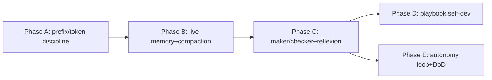

# Plan — Harness Loop Engineering v2 (self-operating, team-grade, token-lean)

**Date:** 2026-06-23 · **Method:** deep-research (multi-source web + repo grounding; load-bearing claims cross-verified) · **Scope:** nâng cấp "loop engineering" của `8sync harness` để agent **tự vận hành dài hạn**, chất lượng cao **như một team**, tận dụng **cực mạnh** các tool tối ưu token (headroom, codegraph, codebase-memory-mcp) — **mà không** phình stable-prefix. Sources + verification ở `.provenance.md` sidecar; inline `[n]` map sang đó.

> **Trạng thái:** PLAN ONLY — chưa code. Mọi mục đều ghi rõ *điểm chạm* (`file:line` / function) để thực thi sau.

---

## 0. Nguyên tắc chỉ đạo (đọc trước)

Yêu cầu "inject cực mạnh tool tối ưu token" + "chạy liên tục dài hạn" có **mâu thuẫn nội tại** với bài học #1 của agent production:

- **KV-cache hit-rate là metric quan trọng nhất của agent** — mọi byte volatile ở đầu context (timestamp, block tự ghi lại mỗi lần) **phá cache toàn bộ phần sau**, tăng cả latency lẫn cost `[2][3]`.
- **Progressive disclosure** (Anthropic Skills): nạp *metadata* skill trước, *body* chỉ khi cần — không bắt đọc hết upfront `[1][4]`.

→ **Nguyên tắc lõi của v2:** *"Inject strong DEFAULTS & ENFORCEMENT, **không** inject thêm CONTEXT."* Tăng sức mạnh tool = ép dùng đúng (hành vi mặc định + self-check), **không** = nhồi thêm chữ vào prefix. Stable-prefix phải **lean + byte-stable** giữa các lần chạy.

---

## 1. Hiện trạng (grounded)

**Senses (token-optimizers đã wiring):**
- `codegraph` — graph local pre-index; `ensure_codegraph` + `ensure_codegraph_init` (`deploy.rs:140,177`). Inject là RULE #0 (`00-force-load.md:3-11`).
- `codebase-memory-mcp` (cbm) — MCP stdio, `auto_index=true`, đăng ký `~/.omp/agent/mcp.json` (`deploy.rs:200-224`, `register_omp_mcp` `:228-262`), index mỗi pass (`index_codebase_memory` `:266-276`).
- `headroom` — MCP nén output, `headroom mcp serve` (`deploy.rs:281-299`). Hiện chỉ được khuyến nghị "nén output dài" (`00-force-load.md:10`).

**Memory spine:** `agents/{PROJECT,KNOWLEDGE,DECISIONS,PREFERENCES,STATE,NOTES}.md` (`memory.rs:75`). KNOWLEDGE = managed breadcrumb (ghi đè mỗi `harness up`) + zone `## Learnings` append-only với prefix `validated:`/`hypothesis:` (`memory.rs:80-127`). `consolidate_learnings` BUDGET=200 dòng → archive (`memory.rs:135-174`). gitleaks pre-commit (`memory.rs:179-197`).

**Driver:** `harness` (bare) = full pass — deploy + update manifest + mirror + ensure tools + index + inject + seed + consolidate (`auto.rs:17-73`). `harness up` = light refresh + `--pull/--commit/--loop/--timer` (systemd user timer) (`up.rs:16-65,159-209`).

**Injection:** `inject_agents_md` viết force-load block vào AGENTS.md/CLAUDE.md/… (`inject.rs:88-240`); `always_on_rank` xếp hạng (`inject.rs:39-51`); tech-gating (encore).

**Đánh giá:** bộ khung đã có "senses + memory + hands + driver" — tốt. Thiếu **kỷ luật context-engineering** (KV-cache, recitation, compaction), **vòng verify khép kín** (Reflexion), và **tự sinh tài sản tái dùng** (Voyager). Đó là nội dung v2.

---

## 2. Gap analysis (phát hiện → nguồn → điểm chạm)

| # | Gap | Bằng chứng best-practice | Điểm chạm trong repo |
|---|-----|--------------------------|----------------------|
| G1 | **Volatile prefix phá KV-cache** | timestamp/biến động ở prefix "kills cache reuse" `[2][3]` | `now_stamp()` nhét `epoch:<n>` vào breadcrumb KNOWLEDGE được đọc vào context (`memory.rs:104-127`); breadcrumb đổi mỗi lần ⇒ `upsert_block` (`memory.rs:21-42`) luôn rewrite |
| G2 | **Bắt đọc 8 SKILL.md upfront** thay vì progressive disclosure | Anthropic Skills: metadata trước, body khi cần `[1][4]` | mandatory reading order (`00-force-load.md:13-26`) |
| G3 | **Không có recitation** (todo/plan ở cuối context) | Manus todo.md = "attention manipulation", chống lost-in-the-middle `[5][6]` | STATE.md seed 1 lần, không có protocol re-write (`memory.rs:75`) |
| G4 | **Không có compaction + context-budget awareness** | compaction = tóm tắt → reinit; context-awareness feedback budget còn lại `[1][7]` | headroom chỉ "nén output" (`00-force-load.md:10`), không có protocol reinit |
| G5 | **Maker/checker chỉ advisory**, subagent không "share full traces" | Anthropic: orchestrator giao objective/boundary/output rõ; Cognition: share full trace, tránh conflicting decisions `[8][9][10]` | loop §maker/checker (`00-force-load.md:61`) — chưa có contract |
| G6 | **Không có skill-library tự sinh** (procedural memory) | Voyager: lưu code đã verify, index theo mô tả, tái dùng `[11][12]` | chỉ vendor skill do người viết; KNOWLEDGE chỉ verbal |
| G7 | **Reflexion loop chưa khép kín** (thất bại không sinh reflection dẫn hướng) | Reflexion: Actor→Evaluator→Self-reflection vào memory `[13][14]` | có `validated:/hypothesis:` nhưng không bắt ghi `failure:` + surface đầu phiên |
| G8 | **Không có DoD ledger / initializer↔continuer** cho feature đa phiên | Anthropic long-horizon harness: initializer dựng feature-list/progress, coder tiến từng phiên, giữ clean state `[15][16]` | STATE.md tự do, không cấu trúc Goal/Feature/Done/Next/DoD |
| G9 | **Headroom + code-intel chưa được ép mạnh + đo lường** | programmatic tool-calling/structured output giảm token vào context `[1][7]` | RULE #0 là khuyến nghị, không threshold/seft-check |
| G10 | **L1→L3 autonomy + timer-loop chưa định nghĩa việc làm** | phased autonomy cần guardrail rõ `[1]` | timer chỉ chạy `harness up` (re-inject + reindex) (`up.rs:159-209`) |

---

## 3. Đề xuất nâng cấp — 5 phase

> Mỗi mục: **Thay đổi** (điểm chạm) · **Vì sao** (cite) · **Rủi ro/verify**. Không code ở đây.

### Phase A — Stable-prefix & token discipline *(nền tảng, làm trước)*

- **A1. Khử volatile khỏi context-loaded prefix (KV-cache).** Bỏ `epoch:<n>` khỏi breadcrumb KNOWLEDGE *được đọc vào context*; nếu cần stamp, để ở comment cuối file hoặc out-of-context. Đảm bảo force-load block + breadcrumb **byte-identical** giữa 2 lần `harness up` khi nội dung không đổi (hiện `upsert_block` đã so sánh `if new != existing` `memory.rs:35-40` — nhưng stamp luôn khác ⇒ luôn ghi). *Vì sao:* `[2][3]`. *Verify:* chạy `harness up` 2 lần liên tiếp → `git diff` rỗng trên AGENTS.md/KNOWLEDGE breadcrumb.
- **A2. Progressive disclosure cho skills.** Thu nhỏ tập "đọc-ngay bắt buộc" về lõi thật sự (codegraph · karpathy · ponytail · 8sync-cli). impeccable/assp/taste/image-routing → **chỉ liệt kê 1 dòng capability + path**, đọc body khi task khớp trigger. *Vì sao:* `[1][4]`. *Điểm chạm:* `00-force-load.md:13-26`, `always_on_rank` `inject.rs:39-51`. *Verify:* đếm token prefix giảm; smoke `harness init` vẫn ra block hợp lệ.
- **A3. Headroom = mặc định cho MỌI output lớn, có threshold.** Đổi RULE #0 từ "nên nén" → "BẮT BUỘC nén qua `headroom_compress` khi output > N dòng/tokens (log, diff, test, dump)"; cấm dump thô. *Vì sao:* `[1][7]`. *Điểm chạm:* `00-force-load.md:10,53`. *Verify:* checklist trong force-load + ví dụ ngưỡng cụ thể.

### Phase B — Live memory & recitation

- **B1. STATE.md = live plan (recitation).** Định nghĩa protocol: agent **rewrite STATE.md** (Goal · Checklist · Current step) ở mỗi phase-boundary; force-load yêu cầu đọc STATE đầu phiên + cập nhật cuối mỗi bước → giữ kế hoạch ở "recent context". *Vì sao:* `[5][6]`. *Điểm chạm:* template seed (`memory.rs:75-87`), rule (`00-force-load.md:54`).
- **B2. Compaction protocol.** Khi context gần ngưỡng: ghi **handoff có cấu trúc** (Done/In-flight/Next/Open-questions) vào STATE.md + bài học vào KNOWLEDGE, rồi reinit phiên mới chỉ đọc spine. Dùng headroom làm summarizer. *Vì sao:* `[1]` (compaction). *Điểm chạm:* mục mới trong `00-force-load.md` §loop.
- **B3. Context-budget awareness.** Hướng dẫn agent ước lượng budget còn lại và *chủ động* compaction/handoff trước khi tràn (thay vì để harness cắt). *Vì sao:* `[1][7]`.

### Phase C — Maker/checker + verify-loop khép kín

- **C1. Contract maker→checker.** Định nghĩa rõ: *implementer* subagent (own context) → *verifier* subagent độc lập chạy build/test/benchmark, trả `validated|failed` + log (đã nén). Orchestrator giao **objective + boundaries + output-format** rõ cho từng subagent (chống duplicate/gap). *Vì sao:* Anthropic orchestration `[8]`; Cognition: **share full trace** cho việc phụ thuộc, **parallel chỉ khi subtask độc lập** `[9][10]`. *Điểm chạm:* `00-force-load.md:61` + skill `full-flow`.
- **C2. Reflexion failure-capture.** Verify `failed` ⇒ bắt buộc ghi `failure:`/`hypothesis:` vào KNOWLEDGE (nguyên nhân + cách sửa đề xuất); đầu phiên **surface N failure gần nhất** để không lặp lỗi. *Vì sao:* `[13][14]`. *Điểm chạm:* zone Learnings (`memory.rs:80-127`).

### Phase D — Self-development (procedural memory kiểu Voyager)

- **D1. Playbook tự sinh từ trajectory đã verify.** Khi một quy trình đa bước **đã `validated:`** (test/build pass), distill thành runbook tái dùng — `agents/PLAYBOOKS.md` (hoặc `agents/skills/<learned>/SKILL.md`) **index theo mô tả** để retrieve lần sau, thay vì suy luận lại từ đầu. Đây chính là cơ chế "tự phát triển như một team": biến *successes đã kiểm chứng* thành *tài sản tái dùng*. *Vì sao:* Voyager skill-library `[11][12]`; verify-gate đã có (`validated:`). *Điểm chạm:* seed file mới + rule trong force-load; có thể tái dùng `consolidate_learnings` pattern.
- **D2. Phân tầng memory rõ ràng.** KNOWLEDGE = *verbal lessons* (Reflexion); PLAYBOOKS/skills = *procedural đã-verify* (Voyager); DECISIONS = *ADR*. Tránh trộn → retrieve sạch hơn. (cbm `manage_adr` có thể là backend cho DECISIONS).

### Phase E — Autonomy loop L1→L3

- **E1. Định nghĩa việc của timer-loop.** Mỗi tick `harness up --timer`: đọc STATE → chọn `Next` → (L2+) thực thi → **verify-gate** → cập nhật STATE/KNOWLEDGE → (`--commit`) commit (gitleaks đã chặn secret). Hiện tick chỉ re-inject + reindex (`up.rs:159-209`). *Vì sao:* phased autonomy `[1]`.
- **E2. DoD ledger + clean-state.** STATE.md cấu trúc: Goal · Feature-list · Done · In-flight · Next · **Definition-of-Done**; rule "luôn để lại trạng thái build sạch cuối phiên". *Vì sao:* Anthropic long-horizon harness (initializer dựng feature-list/progress; coder giữ clean state) `[15][16]`.
- **E3. Guardrails autonomy.** L1 report-only · L2 assisted (đề xuất diff, chờ duyệt) · L3 unattended chỉ khi bật tường minh + verify-gate + scope-limit + commit-scoped (chỉ `agents/`+docs trừ khi cho phép). Không tự `push`/PR ở L3 mặc định.

---

## 4. Thứ tự ưu tiên (quick-win trước)

1. **A1, A3** — rẻ, tác động ngay (cache + token). 
2. **A2, B1** — giảm prefix + thêm recitation. 
3. **C1, C2** — chất lượng "team-grade" + chống lặp lỗi. 
4. **B2/B3** — bền cho phiên dài. 
5. **D1/D2, E1/E2/E3** — tự-phát-triển + tự-vận-hành dài hạn.

---

## 5. Rủi ro & non-goals

- **KHÔNG phình prefix.** Mọi mục "inject mạnh" = default/enforcement, không phải thêm chữ. Vi phạm = đánh mất chính token-saving đang theo đuổi `[2]`.
- **KHÔNG naive multi-agent cho coding phụ thuộc cao.** Parallel chỉ cho subtask **độc lập**; việc phụ thuộc phải share full trace hoặc chạy serial `[9][10]`. Multi-agent tốn ~15× token `[8]` — chỉ dùng khi giá trị xứng.
- **KHÔNG train model / KHÔNG đổi trọng số.** v2 là context-engineering layer (file + protocol + force-load + timer behavior), do omp thực thi. Realistic với kiến trúc 8sync.
- **Volatile metrics** (KV-hit, token saved) nếu thêm phải **out-of-context** (log/CHANGELOG), không nhét vào prefix (vòng lại G1).

---

## 6. Chiến lược verify (khi thực thi)

- **A1:** `harness up` ×2 → `git diff --stat` rỗng trên file inject.
- **A2:** đo số dòng/token block force-load trước/sau; `harness init` smoke vẫn hợp lệ.
- **A3/B/C:** kịch bản thật — task có log/diff lớn → xác nhận đi qua headroom; task fail → xác nhận có entry `failure:` + được surface phiên sau.
- **D1:** sau 1 quy trình `validated:`, kiểm tra có runbook index-by-description; phiên sau retrieve được.
- **E1/E2:** dựng repo demo, bật timer ngắn, xác nhận mỗi tick đọc STATE→verify→cập nhật, để clean state, commit scoped.

---

## 7. Tóm tắt 1 dòng

Biến harness từ *"inject skill + index"* thành **vòng lặp context-engineering kỷ luật**: prefix lean+stable (KV-cache), recitation+compaction cho phiên dài, maker/checker + Reflexion khép kín cho chất lượng team, và Voyager-style playbook để **tự tích lũy năng lực** — tất cả trong khi **ép dùng cực mạnh** codegraph/cbm/headroom như default bắt buộc, không nhồi thêm context.
